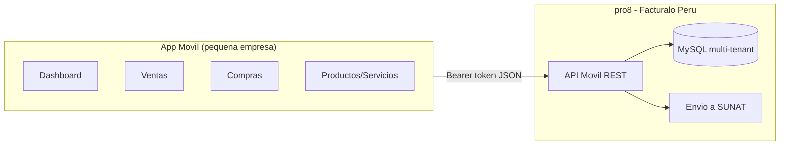
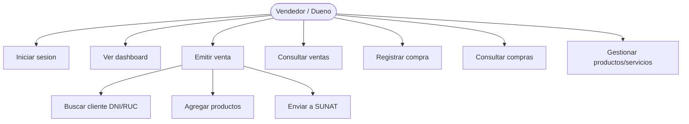
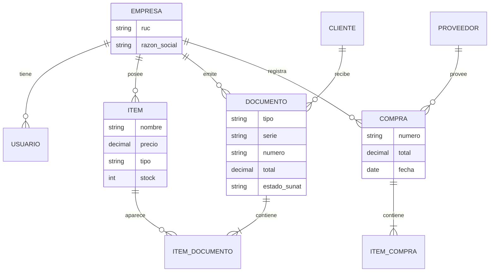
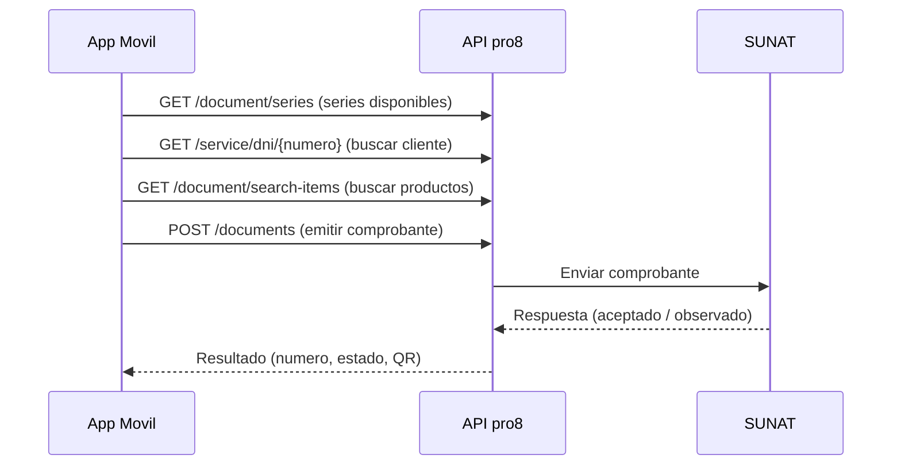
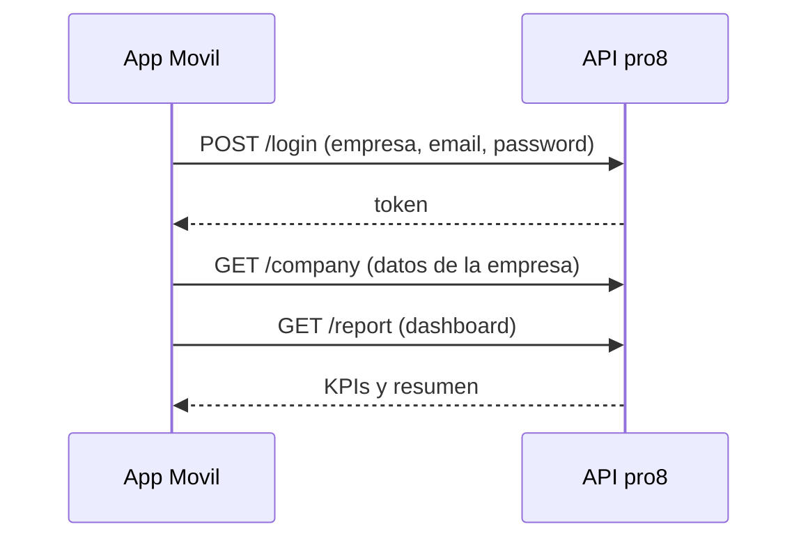

# Móvil Facturador

Brief de producto y diseño para una **aplicación móvil** dirigida a **pequeñas empresas**, que se conecta al facturador electrónico **pro8** (Facturalo Perú) y les permite trabajar desde el celular con los módulos esenciales: **Dashboard, Ventas, Compras y Productos/Servicios**.

Este documento sirve como insumo para generar el **prototipo de interfaz en Claude design**.

---

## 1. Contexto del producto

El facturador pro8 es un sistema web **multiempresa (multi-tenant)** que emite comprobantes electrónicos ante SUNAT. Hoy se usa desde el navegador.

La idea de **Móvil Facturador** es ofrecer a las **pequeñas empresas** una app móvil sencilla para que puedan:

- Ver cómo va su negocio (Dashboard).
- Emitir y consultar **ventas** (boletas, facturas, notas de venta).
- Registrar y consultar **compras**.
- Administrar su catálogo de **productos y servicios**.

**Punto clave del negocio:** el cliente **se crea igual que un cliente normal** del facturador (un tenant/empresa en pro8). No hay un registro aparte. La app móvil simplemente **inicia sesión con esas credenciales** y **consume exclusivamente las APIs de esos cuatro módulos**. Todo lo demás (configuración avanzada, otros módulos) sigue en la web.

> En una frase: **mismo backend, mismos datos, mismo login; solo cambia la cara (una app móvil enfocada en 4 módulos).**

---

## 2. Cómo se conecta (modelo de acceso)

1. Una empresa se da de alta en pro8 **como cualquier cliente** (se le crea su tenant/subdominio, ej. `miempresa.facturador.com`).
2. El dueño/vendedor abre la app móvil e ingresa:
   - **Empresa** (subdominio o RUC, para saber a qué tenant entrar).
   - **Usuario** (email) y **contraseña**.
3. La app llama al **login de la API móvil** de pro8, recibe un **token** y, a partir de ahí, **solo consume los endpoints de Dashboard, Ventas, Compras y Productos**.
4. El token se guarda de forma segura en el dispositivo y se envía en cada petición.

La app **no expone** ni toca otros módulos del facturador.

---

## 3. Módulos y pantallas

### 3.1. Dashboard (inicio)
Resumen del negocio del día y del mes.

- **Tarjetas (KPIs):** total vendido hoy, total del mes, número de comprobantes, ticket promedio.
- **Gráfico** de ventas por día (últimos 7/30 días).
- **Top productos** más vendidos.
- **Accesos rápidos:** "Nueva venta", "Nueva compra", "Nuevo producto".
- Filtro de **periodo** (hoy / semana / mes).

### 3.2. Ventas
El corazón de la app.

- **Listado de ventas** (comprobantes): número, cliente, fecha, total, estado SUNAT (aceptado/observado/anulado), tipo (boleta/factura/nota). Con **filtro por fecha** y buscador.
- **Detalle de una venta:** items, totales (neto, IGV, total), cliente, estado, acciones (enviar por correo, descargar PDF, ver QR).
- **Nueva venta (emitir comprobante):**
  - Elegir **tipo de comprobante** (boleta / factura / nota de venta) y **serie**.
  - **Cliente:** buscar por DNI/RUC (consulta Reniec/Sunat) o "Cliente varios".
  - **Agregar productos/servicios** (buscar del catálogo, cantidad, precio).
  - **Resumen:** neto, IGV, total.
  - **Medio de pago** (efectivo, tarjeta, transferencia, etc.).
  - Botón **Emitir** → genera el comprobante en SUNAT y muestra el resultado (número + QR).

### 3.3. Compras
Registro de las compras del negocio.

- **Listado de compras:** proveedor, fecha, número de documento, total.
- **Detalle de compra:** items, totales, proveedor.
- **Nueva compra:** proveedor (buscar por RUC), productos, cantidades, costos, total, registrar.

> Nota técnica (ver sección 5): la API móvil hoy expone compras de forma limitada (liquidación de compra). Para el listado/creación completos puede requerir **exponer endpoints adicionales** en pro8.

### 3.4. Productos / Servicios
Catálogo del negocio.

- **Listado** de productos/servicios: nombre, precio, stock (si es producto), categoría.
- **Buscador** y filtro por categoría / tipo (producto vs servicio).
- **Crear / editar** producto o servicio: nombre, descripción, precio, unidad, afectación IGV, categoría, imagen, stock inicial.

---

## 4. Principios de diseño (para Claude design)

- **Móvil primero**, táctil, para usar a una mano. Botones grandes.
- **Simple y rápido:** una pequeña empresa no quiere complejidad; flujos de 2-3 toques.
- **Navegación inferior (bottom tab):** Dashboard · Ventas · Compras · Productos. El botón central "+" para acción rápida (nueva venta).
- **Estados claros:** un comprobante aceptado/observado/anulado debe distinguirse por color y etiqueta.
- **Identidad:** limpio, profesional, confiable (es facturación). Paleta sobria con un color de marca; soporte de tema claro/oscuro.
- **Feedback inmediato:** toasts de éxito/error al emitir, guardar, enviar.
- **Vacíos amables:** estados vacíos con llamado a la acción ("Aún no tienes ventas, emite la primera").

---

## 5. Arquitectura

```
┌─────────────────────────┐        HTTPS / REST + token        ┌──────────────────────────┐
│   App Móvil (cliente)    │  ───────────────────────────────▶ │   pro8 (Facturalo Perú)   │
│  Dashboard · Ventas ·    │                                    │   API móvil multi-tenant   │
│  Compras · Productos     │  ◀─────────────────────────────── │   (Laravel, MySQL, SUNAT)  │
└─────────────────────────┘            JSON                     └──────────────────────────┘
```

- **No hay backend propio nuevo.** La app reusa el backend de pro8 y su **API móvil** (`/api/...`).
- **Multi-tenant:** el tenant se determina por el dominio/empresa elegida al iniciar sesión (igual que la web).
- **Autenticación:** token (Bearer) emitido por el login móvil; se envía en cada petición.
- **El facturador es la única fuente de verdad** (la app no guarda datos de negocio localmente, salvo caché ligera).

### Stack recomendado para la app
- **React Native + Expo + TypeScript** (rápido de desarrollar, multiplataforma iOS/Android, alineado con el conocimiento de React del equipo).
- **Estado/datos:** React Query (cacheo y sincronización de las APIs) + almacenamiento seguro del token (Expo SecureStore).
- **UI:** una librería de componentes móvil (ej. React Native Paper o Tamagui) + íconos.

---

## 6. Contrato de API (endpoints reales de pro8)

Todos bajo `https://<empresa>/api/` con header `Authorization: Bearer <token>`.

### Autenticación
| Acción | Método | Endpoint |
|---|---|---|
| Iniciar sesión | POST | `/api/login` (devuelve `token`) |
| Datos de empresa | GET | `/api/company` |

### Dashboard
| Acción | Método | Endpoint |
|---|---|---|
| Resumen / reporte | GET | `/api/report` (totales de ventas por periodo) |

### Ventas
| Acción | Método | Endpoint |
|---|---|---|
| Listar comprobantes | GET | `/api/documents/lists` · `/api/documents/lists/{desde}/{hasta}` |
| Emitir comprobante | POST | `/api/documents` |
| Enviar a SUNAT / reenviar | POST | `/api/documents/send` |
| Series de comprobante | GET | `/api/document/series` |
| Medios de pago | GET | `/api/document/paymentmethod` |
| Listar notas de venta | GET | `/api/sale-note/lists` |
| Emitir nota de venta | POST | `/api/sale-note` |
| Series de nota de venta | GET | `/api/sale-note/series` |
| Convertir nota a CPE | POST | `/api/sale-note/{id}/generate-cpe` |

### Clientes (para emitir ventas)
| Acción | Método | Endpoint |
|---|---|---|
| Buscar cliente por DNI/RUC | GET | `/api/service/{dni|ruc}/{numero}` |
| Buscar clientes | GET | `/api/document/search-customers` |
| Listar clientes | GET | `/api/document/customers` |
| Crear/guardar cliente | POST | `/api/person` |

### Productos / Servicios
| Acción | Método | Endpoint |
|---|---|---|
| Buscar items | GET | `/api/document/search-items` |
| Crear item | POST | `/api/item` |
| Actualizar item | POST | `/api/items/{id}/update` |
| Subir imagen | POST | `/api/item/upload` |

### Compras
| Acción | Método | Endpoint |
|---|---|---|
| Liquidación de compra | POST | `/api/purchase-settlements` |
| Listado/creación completa de compras | **Pendiente** | requiere exponer endpoints adicionales en pro8 (hoy el grueso de compras vive en la web) |

> **Gap a resolver:** el módulo de **Compras** en la API móvil está incompleto. Para el listado y registro completo de compras hay que **agregar endpoints** en pro8 (reusando el `PurchaseController` de la web). Se documenta como tarea previa al desarrollo del módulo Compras.

---

## 7. Diagramas

### 7.1. Arquitectura



### 7.2. Casos de uso



### 7.3. Modelo de datos (vista lógica, vive en pro8)



### 7.4. Secuencia: emitir una venta



### 7.5. Secuencia: login y carga inicial



---

## 8. MVP (primera versión)

1. **Login** (empresa + usuario + contraseña) + guardar token seguro.
2. **Dashboard** con KPIs y resumen del periodo.
3. **Ventas:** listado + detalle + **emitir** (boleta/nota de venta, cliente, productos, pago, envío a SUNAT).
4. **Productos/Servicios:** listado + buscar + crear/editar.
5. **Compras:** listado + detalle (creación completa según el gap de la sección 6).

Fases siguientes: factura, multi-serie, reportes avanzados, modo offline para zonas sin internet, impresión de ticket.

---

## 9. Consideraciones

- **Seguridad:** token en almacenamiento seguro del dispositivo; cerrar sesión limpia el token; manejar expiración (401 → reloguear).
- **Multi-tenant:** el campo "Empresa" del login define el tenant; recordarlo para no reescribirlo cada vez.
- **Conectividad:** la app depende de internet (es facturación en línea); contemplar mensajes claros cuando no hay conexión y, a futuro, una cola offline para ventas.
- **Permisos/roles:** respetar el rol del usuario del facturador (lo que puede ver/hacer lo define pro8).
- **Compras:** confirmar con el equipo de pro8 los endpoints faltantes antes de construir ese módulo.

---

## 10. Resumen para el diseño

App móvil de 4 módulos (**Dashboard, Ventas, Compras, Productos/Servicios**), navegación inferior con botón central de acción rápida, estética limpia y confiable de facturación, tema claro/oscuro, flujos cortos. Reusa el backend de pro8 vía su API móvil; el cliente es una empresa creada normalmente en el facturador. Con este documento y los diagramas, Claude design puede generar el prototipo de las pantallas.
